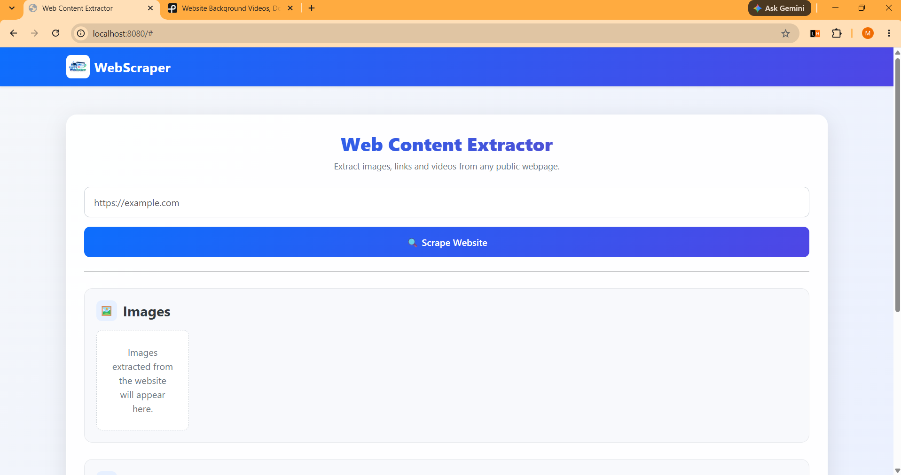
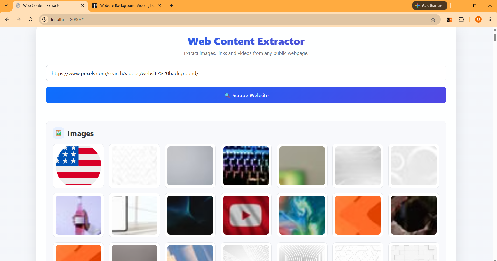
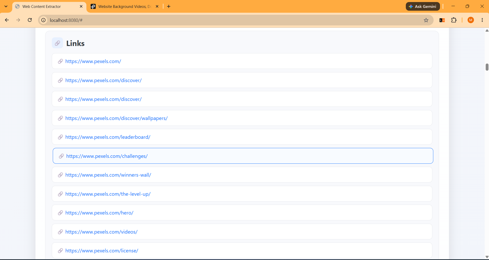
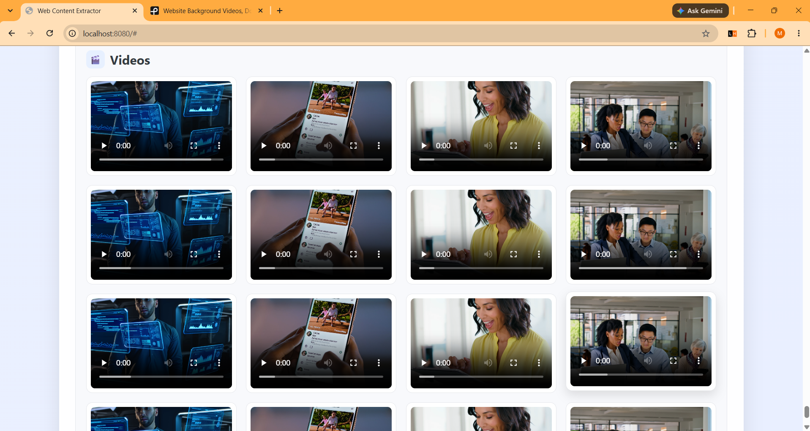

# 🌐 WebScraper

A modern and user-friendly **WebScraper** built using **Spring Boot, Java, HTML, CSS, JavaScript, and Bootstrap**.

The application allows users to enter a website URL and extract useful web resources such as **images, links, and videos** from the webpage.

---

## 🚀 Features

### 🌐 Website Scraping

* Enter a website URL.
* Send the URL to the Spring Boot backend.
* Extract useful content from the webpage.
* Display extracted content in an organized interface.

### 🖼️ Image Extraction

* Extract images available on the webpage.
* Display images in a responsive grid.
* Preview extracted images directly in the application.
* Responsive image cards.

### 🔗 Link Extraction

* Extract links available on the webpage.
* Display extracted URLs in an organized list.
* Open extracted links in a new browser tab.
* Responsive URL formatting.

### 🎬 Video Extraction

* Extract video resources from the webpage.
* Display videos using an HTML5 video player.
* Play supported extracted videos directly in the application.

### 🎨 Modern User Interface

* Clean and modern design.
* Responsive Bootstrap-based interface.
* Gradient navigation bar.
* Custom WebScraper logo.
* Card-based result sections.
* Responsive image and video grids.
* Hover effects.
* Loading indicator while scraping.
* Empty-state messages.
* Mobile-friendly layout.

---

## 🛠️ Technologies Used

* **Java**
* **Spring Boot**
* **Spring MVC**
* **HTML5**
* **CSS3**
* **JavaScript**
* **Bootstrap 5**
* **Maven**

---

## 📁 Project Structure

```text
WebScrapping
│
├── src
│   └── main
│       ├── java
│       │   └── com
│       │       └── WebScrapping
│       │           │
│       │           ├── Controller
│       │           │   └── ScrapeController.java
│       │           │
│       │           ├── Service
│       │           │   └── ScrapeService.java
│       │           │
│       │           └── WebScrappingApplication.java
│       │
│       └── resources
│           │
│           ├── static
│           │   └── images
│           │       └── logo.png
│           │
│           └── templates
│               └── index.html
│
├── SS
│   ├── Home.png
│   ├── Images.png
│   ├── Links.png
│   └── Videos.png
│
├── pom.xml
├── README.md
└── .gitignore
```

---

# 🖥️ Screenshots

## 🏠 Home Page

The main page allows the user to enter a website URL and start the scraping process.



---

## 🖼️ Extracted Images

The application displays images extracted from the entered webpage in a responsive image grid.



---

## 🔗 Extracted Links

All extracted webpage links are displayed in an organized list and can be opened in a new browser tab.



---

## 🎬 Extracted Videos

Supported video resources extracted from the webpage are displayed using HTML5 video players.



---

# 🔄 Application Workflow

```text
                  ┌────────────────────┐
                  │       User         │
                  └─────────┬──────────┘
                            │
                            ▼
                 Enter Website URL
                            │
                            ▼
                 Click "Scrape Website"
                            │
                            ▼
                ┌──────────────────────┐
                │   Spring Boot API    │
                │    /api/scrape       │
                └──────────┬───────────┘
                           │
                           ▼
                 Website Content
                    Extraction
                           │
             ┌─────────────┼─────────────┐
             ▼             ▼             ▼
          Images         Links         Videos
             │             │             │
             └─────────────┼─────────────┘
                           │
                           ▼
                  Display Results
                           │
                           ▼
                     WebScraper UI
```

---

# 🔌 API Endpoint

The frontend communicates with the backend through:

```text
GET /api/scrape?url={website-url}
```

### Example

```text
http://localhost:8080/api/scrape?url=https://example.com
```

The backend returns the extracted content in JSON format.

### Example Response

```json
{
    "images": [],
    "links": [],
    "videos": []
}
```

---

# ⚙️ Installation & Setup

## 1. Clone the Repository

```bash
git clone https://github.com/madhurkamble/Web-Content-Extractor.git
```

Navigate into the project:

```bash
cd Web-Content-Extractor
```

---

## 2. Open the Project

Open the project using any Java IDE such as:

* VS Code
* IntelliJ IDEA
* Eclipse
* Spring Tool Suite

---

## 3. Build the Project

Using Maven:

```bash
mvn clean install
```

---

## 4. Run the Application

Using Maven:

```bash
mvn spring-boot:run
```

Or run:

```text
WebScrappingApplication.java
```

from your IDE.

---

## 5. Open the Application

After the Spring Boot application starts, open:

```text
http://localhost:8080
```

---

# 📋 Requirements

Before running the project, make sure you have:

* **Java JDK 21** or compatible version
* **Maven**
* **Internet connection**
* **Modern web browser**

### Check Java

```bash
java -version
```

### Check Maven

```bash
mvn -version
```

---

# 🎨 UI Highlights

The application focuses on providing a clean and simple user experience.

### Navigation

* Custom WebScraper logo
* Gradient navigation bar
* Responsive layout

### Scraping Interface

* Simple URL input
* Scrape Website button
* Loading indicator
* Error handling

### Results

* Separate sections for Images, Links, and Videos
* Responsive cards
* Hover effects
* Empty-state messages
* Mobile-friendly layout

---

# 📊 Extracted Content

The application currently extracts:

| Content    | Description                          |
| ---------- | ------------------------------------ |
| 🖼️ Images | Images found on the webpage          |
| 🔗 Links   | Hyperlinks found on the webpage      |
| 🎬 Videos  | Video resources found on the webpage |

---

# 🔮 Future Improvements

Possible future enhancements include:

* 📄 Extract webpage text
* 📝 Extract page title and metadata
* 🔍 Keyword extraction
* 📊 Website statistics
* 📸 Download extracted images
* 🎬 Download supported video resources
* 📋 Export results to CSV
* 📋 Copy extracted links
* 🌙 Dark mode
* 🔐 User authentication
* 📜 Scraping history
* 📁 Export complete scraping results

---

# ⚠️ Important Note

This application is created for **educational and development purposes**.

When scraping websites, users should respect:

* Website Terms of Service
* `robots.txt`
* Copyright restrictions
* Privacy requirements
* Applicable laws and regulations

Only scrape websites and content that you are authorized to access.

---

# 👨‍💻 Author

## Madhur Kamble

Computer Engineering Student & Developer

### 🐙 GitHub

[https://github.com/madhurkamble](https://github.com/madhurkamble)

### 💼 LinkedIn

[https://linkedin.com/in/madhur-kamble-55911b290](https://linkedin.com/in/madhur-kamble-55911b290)

---

# 📌 Project Repository

[https://github.com/madhurkamble/Web-Content-Extractor](https://github.com/madhurkamble/WebScraper)

---

# 📄 License

This project is created for **educational and development purposes**.
